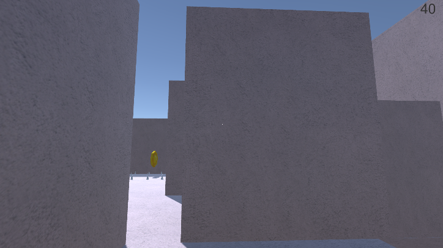
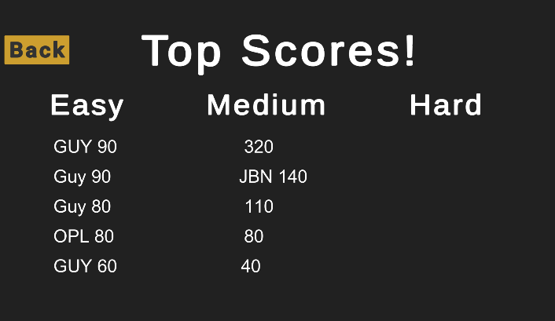

# **The Amazing Maze**

**Main idea:**

The idea of our game is familiar in every home!

We want to give this familiar game a slightly different, more sophisticated angle 
 and with features and obstacles from the realm of puzzle-platform games.

 

**Game's purpose:**

The player must advance in an area defined as a "maze" within a variety of walls bounded by walls, with only a single path leading from the starting point to the end point.

The main goal of the player is to get from the starting point of the maze to the ending point while dealing with a changing route, unfamiliar routes and obstacles.

The player must learn the correct route during the game, in order not to repeat his tracks so that he can proceed to the exit.

 

**The course of the game and means of control:**
The maze is played from the point of view of the actor / character – FP / POV.
The player will select the preferred game mode and the difficulty level of the maze using the mouse or keyboard.
The player will control the character in the game in the middle of the WASD keys, the space bar to jump, the Ctrl key to crouch.
The player will face different obstacles and different terrains during his stay in the maze.

 

**Construction of the maze:**
The construction of the maze is done in a procedural manner according to the definition of the game planners, either randomly or under some predetermined heuristic.

The algorithm works as follows:

* Set the parameters of the maze size (length, width, and size of the tile).

* A base form is created before the further construction of the maze in accordance with the size of the maze provided, that is, floor and walls that form a grid.

  

The construction of the tracks is divided into 2 cases depending on the choice of game mode:

* For Regular game mode and Timed game mode:

  There is a class that randomly selects a direction of progress and deletes walls in the same direction as long as they do not go beyond the set grid limits and do not try to delete a wall of a previously treated tile.
  This process continues iteratively until all the squares in the grid are treated.

 

* For the game mode of the snake and the game mode of the corridors:

  The direction of progress is selected in a certain way (left, right, up, down), then, the walls are deleted in the chosen direction and finally, the transitions between the corridors are selected in a certain way depending on the game mode.

 

**Game modes + difficulty levels**:

**Regular**:

Changing maze size, random maze layout, with a single route that leads from the starting point to the end point, with a variety of obstacles, powerUps and coins to collect and whose end result is measured by the amount of coins collected.

For this game mode, there are 3 difficulty levels which are expressed in the size of the maze, and as a result the length of the routes and the number of different possible routes.

**Timed**:

Fixed maze size, random maze layout, with a single route leading from the starting point to the end point, with a variety of obstacles, powerUps and clocks to collect and whose result is measured by the amount of time it took the player to complete the maze.

The player has a certain amount of time to complete the maze depending on the difficulty level, with each clock collected adding time to the remaining time, if the time reaches 0 and the player does not finish, he loses.

For this game mode, there are 3 difficulty levels which are expressed in the initial time the player must solve the maze.

 

**Snake Trail:**

The size of the maze is fixed, the layout of the maze is arranged in the shape of a snake, first winding laterally and then lengthwise.

Has a single track that leads from the start point to the end point, has a variety of obstacles, powerUps and coins to collect.

**Corridors of Death:**

The size of the maze is fixed, the layout of the maze is arranged in the form of long corridors along or across and have random passages that advance to the next corridor.

Has a single track that leads from the start point to the end point, has a variety of obstacles, powerUps and coins to collect.

 

**Collectibles:**

In the game there are several types of collectibles that can be collected and lead to different results:

 

**Coins:**

Add 10 points Learn the player's points in the various game modes, determine the player's score in the normal table of records, are used to buy some of the powerups.

 

**Watches:**

Adds 10 seconds to the time left to solve the maze in the game mode of time.

**Double:**

Multiplies the value of the coins collected for a limited time.

 

**Question Mark:**

Teleports the player to a random location around the maze.

 

 

**Immunity:**

Creates immunity to any obstacle that can lead to disqualification throughout the maze for a limited time.

 

**Obstacles:**

There are several types of obstacles in the game that aim to make it difficult and disqualify the player when trying to solve the maze:

 

**Spikes:**

Conical spines rising and falling from the floor of the maze, a collision with them leads to the disqualification of the player's current run.

 

**Pits of doom:**

Pits in the floor through which a fall leads the player to lose.

 

**The crushing wall:**

A wall that closes and opens against the opposite wall, if the player gets caught between the walls when closing them, he is disqualified.

 

**Other power‪-ups that are not collectible‪:**

**Clue‪:**

The player has limited access to top view of the entire maze which can help him see the correct route and position relative to it when he is stuck and has no direction‪.

**Breaking a wall‪:**

The player has limited access (with a score cost of 50) to break a wall of his choice so that he can go through it as a shortcut and save himself a much longer route‪.

 

**Changes in terrain:**

**Low ceiling:**

As its name implies, a low ceiling that forces the player to use the crouch element.

 

**Quicksand floor:**

A floor that significantly slows down the player while moving on it.

 

**Anti-gravity floor:**

A floor that allows the player to jump to great heights.

 

**Stairs:**

Stairs at different heights that allow the player to ascend and try to see the continuation of the maze.

 

**Menus + Scoreboards:**

The game contains menus as usual.

**Main Menu:**

**Game Modes:**

**Scoreboards containing locally stored information on the player's computer:**

**Controls:**

 

**Tools‪:**

The game is developed on the Unity platform‪.

The scripts were written in C # on Visual Studio‪.

For version management we used Git on Github‪.

The free objects have been downloaded from all sorts of sites like turbo squid and unity store etc‪.

 

**Working methodologies‪:**

Work in pairs with full cooperation and yet division into tasks, as mentioned, managing the versions with Git and tracking the remaining tasks, those performed, and managing a time log (a type of backlog) according to google sheets‪.

 

**Difficulties that arose during work**

**In the obstacle of closing walls**, cause disqualification of the player only when there is contact with both walls at the same time‪:

This element requires a collision between 3 objects simultaneously, the character with wall A, and the character with wall B, only this should trigger a disqualification, but the functions of the collisions in unity are performed procedurally so it is difficult to manage the parallel operations required for this obstacle, finally we were able to split the operations into 2 methods, onEnter, onExit and thus manage the parallelism of the above obstacle‪.

 

**Scoreboards**‪:

The main difficulty we encountered when implementing scoreboards is storing the data for the games that took place, at first we thought about maintaining DB but this implementation seems too complicated compared to the amount of information and the fact that its relative statics‪, also cloud storage felt a bit overkill for our purpose, we googled how to maintain scoreboards that would be convenient to handle and we found the solution of saving the data in a file using the PlayerPrefs library so that the information is stored locally on the player's computer, we translated the data into JSON format and then decoded it before use and sorted according to our decision‪.

 

**Clue power‪-up Implementation‪:**

The idea in this power‪-up implementation was to give a hint to the player that would help him if he got stuck or needed help, for that we thought that "looking over" at the maze while noting his current location could be a good clue‪.

At first, we tried to pick up the camera placed on the character, but we got involved in saving the values to which we need to return at the end of the hint and connecting the object we changed back to the character, as well as a problem with the gravity of the object we lifted‪.

After many attempts, we decided to place another static camera with a fixed position, so that when the player chooses to use this clue, the active cameras will be replaced between the one on the character and the static one with the "looking over", at the end of the allotted time the cameras will switch back‪.

 

**Object construction‪:**

For some of the elements in the game ‪(spikes floor, different collectibles, route changes) we did not find free ready-made objects so we were required to learn to build objects that will be used by us in the game, we had to learn to connect some types of objects and create new shapes‪.